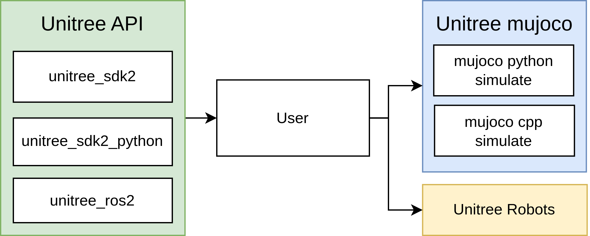

# 介绍
## Unitree mujoco
`unitree_mujoco` 是基于 `Unitree sdk2` 和 `mujoco` 开发的仿真器。用户使用 `Unitree_sdk2`、 `unitree_ros2` 和 `unitree_sdk2_python` 开发的控制程序可以方便地接入该仿真器，实现仿真到实物的开发流程。仓库别基于 c++ 和 python 实现了两个版本的仿真器， 其结构大致如下图所示:



## 目录结构
- `simulate`: 基于 unitree_sdk2 和 mujoco (c++) 实现的仿真器（推荐）
- `simulate_python`: 基于 unitree_sdk2py 和 mujoco (python) 实现的仿真器
- `unitree_robots`: unitree_sdk2 支持的机器人 mjcf 描述文件
- `terrain_tool`: 仿真场景地形生成工具
- `example`: 例程

## 支持的 Unitree sdk2 消息：
**当前版本仅支持底层开发，主要用于控制器的 sim to real 验证**
- `LowCmd`: 电机控制指令
- `LowState`：电机状态
- `SportModeState`：机器人位置和速度

## 消息(DDS idl)类型说明
- Unitree Go2, B2, H1, B2w, Go2w 型号的机器人使用 unitree_go idl 实现底层通信
- Unitree G1, H1-2 型号的机器人使用 unitree_hg 实现底层通信

注：
 1. 电机的编号与机器人实物一致，具体可参考 [Unitree 文档](https://support.unitree.com/home/zh/developer)
 2. 在机器人实物上关闭自带的运控服务后， `SportModeState` 消息是无法读取的。仿真中保留了这一消息，便于用户利用位置和速度信息分析所开发的控制程序。

## 相关链接
- [unitree_sdk2](https://github.com/unitreerobotics/unitree_sdk2)
- [unitree_sdk2_python](https://github.com/unitreerobotics/unitree_sdk2_python)
- [unitree_ros2](https://github.com/unitreerobotics/unitree_ros2)
- [Unitree 文档](https://support.unitree.com/home/zh/developer)
- [mujoco doc](https://mujoco.readthedocs.io/en/stable/overview.html)

# 安装
## c++ 仿真器 (simulate)
### 1. 依赖

```bash
sudo apt install libyaml-cpp-dev libspdlog-dev libboost-all-dev
```

#### unitree_sdk2
推荐将 `unitree_sdk2` 安装在 `/opt/unitree_robotics` 路径下。
```bash
git clone https://github.com/unitreerobotics/unitree_sdk2.git
cd unitree_sdk2/
mkdir build
cd build
cmake .. -DCMAKE_INSTALL_PREFIX=/opt/unitree_robotics
sudo make install
```
详细见：https://github.com/unitreerobotics/unitree_sdk2
#### mujoco

下载mujoco[安装包](https://github.com/google-deepmind/mujoco/releases), 解压到 `~/.mujoco` 目录下;

```
cd unitree_mujoco/simulate/
ln -s ~/.mujoco/mujoco-3.3.6 mujoco
```

### 2. 编译 unitree_mujoco
```
cd unitree_mujoco/simulate/
mkdir build && cd build
cmake ..
make -j4
```

### 3. 测试:
运行：
```bash
./unitree_mujoco -r go2 -s scene_terrain.xml
```
可以看到加载了 Go2 机器人的 mujoco 仿真器。

在新的终端中运行：
```
./test
```
程序会输出机器人在仿真器中的姿态和位置信息，同时机器人的每个电机都会持续输出 1Nm 的转矩。

**注：** 测试程序发送的是 unitree_go 消息，如果需要测试 G1 机器人，需要修改程序使用 unitree_hg 消息。

## Python 仿真器 (simulate_python)
### 1. 依赖
#### unitree_sdk2_python
```bash
cd ~
sudo apt install python3-pip
git clone https://github.com/unitreerobotics/unitree_sdk2_python.git
cd unitree_sdk2_python
pip3 install -e .
```
如果遇到问题：
```bash
Could not locate cyclonedds. Try to set CYCLONEDDS_HOME or CMAKE_PREFIX_PATH
```
参考: https://github.com/unitreerobotics/unitree_sdk2_python

#### mujoco-python
```bash
pip3 install mujoco
```
#### joystick
```bash
pip3 install pygame
```
### 2. 测试
```bash
cd ./simulate_python
python3 ./unitree_mujoco.py
```
在新终端运行
```bash
python3 ./test/test_unitree_sdk2.py
```
程序会输出机器人在仿真器中的姿态和位置信息，同时机器人的每个电机都会持续输出 1Nm 的转矩。

**注：** 测试程序发送的是 unitree_go 消息，如果需要测试 G1 机器人，需要修改程序使用 unitree_hg 消息。


 

# 使用
## 1. 仿真配置
### c++ 仿真器
c++ 仿真器的配置文件位于 `/simulate/config.yaml` 中：
```yaml
# 仿真器加载的机器人名称
# "go2", "b2", "b2w", "h1"
robot: "go2"

# 机器人仿真仿真场景文件
# 以 go2 为例，指的是/unitree_robots/go2/文件夹下的 scene.xml 文件
robot_scene: "scene.xml" 

# dds domain id，最好与实物(实物上默认为 0)区分开
domain_id: 1 
# 网卡名称, 对于仿真建议使用本地回环 "lo"
interface: "lo"

# 是否输出机器人连杆、关节、传感器等信息，1为输出
print_scene_information: 1

# 是否使用虚拟挂带, 1 为启用
# 主要用于模拟 H1 机器人初始化挂起的过程 
enable_elastic_band: 0 # For H1 
```
### python 仿真器
python 仿真器的配置文件位于 `/simulate_python/config.py` 中：
```python
# 仿真器加载的机器人名称
# "go2", "b2", "b2w", "h1"
ROBOT = "go2" 

# 机器人仿真仿真场景文件
ROBOT_SCENE = "../unitree_robots/" + ROBOT + "/scene.xml" # Robot scene

# dds domain id，最好与实物(实物上默认为 0)区分开
DOMAIN_ID = 1 # Domain id
# 网卡名称, 对于仿真建议使用本地回环 "lo"
INTERFACE = "lo" # Interface 

# 是否输出机器人连杆、关节、传感器等信息，True 为输出
PRINT_SCENE_INFORMATION = True 

USE_JOYSTICK = 1 # Simulate Unitree WirelessController using a gamepad
JOYSTICK_TYPE = "xbox" # support "xbox" and "switch" gamepad layout
JOYSTICK_DEVICE = 0 # Joystick number

# 是否使用虚拟挂带, 1 为启用
# 主要用于模拟 H1 机器人初始化挂起的过程 
ENABLE_ELASTIC_BAND = False 

# 仿真步长 单位(s)
# 为保证仿真的可靠性，需要大于 viewer.sync() 渲染一次所需要的时间
SIMULATE_DT = 0.003  

# 可视化界面的运行步长，0.02 对应 50fps/s
VIEWER_DT = 0.02 
```

### 游戏手柄
仿真器会使用 Xbox 或者 Switch 游戏来模拟机器人的无线控制器，并将手柄按键和摇杆信息发布在"rt/wireless_controller" topic。如果手上没有可以使用的游戏手柄，需要将 `config.yaml/config.py` 中的 `use_joystick/USE_JOYSTICK` 设置为 0。如果使用的手柄不属于 Xbox 和 Switch 映射，可以在源码中自行修改或添加(可以使用 `jstest` 工具查看按键和摇杆 id)：

In `simulate/src/unitree_sdk2_bridge/unitree_sdk2_bridge.cc`: 
```C++
 if (js_type == "xbox")
{
    js_id_.axis["LX"] = 0; // Left stick axis x
    js_id_.axis["LY"] = 1; // Left stick axis y
    js_id_.axis["RX"] = 3; // Right stick axis x
    js_id_.axis["RY"] = 4; // Right stick axis y
    js_id_.axis["LT"] = 2; // Left trigger
    js_id_.axis["RT"] = 5; // Right trigger
    js_id_.axis["DX"] = 6; // Directional pad x
    js_id_.axis["DY"] = 7; // Directional pad y
    
    js_id_.button["X"] = 2;
    js_id_.button["Y"] = 3;
    js_id_.button["B"] = 1;
    js_id_.button["A"] = 0;
    js_id_.button["LB"] = 4;
    js_id_.button["RB"] = 5;
    js_id_.button["SELECT"] = 6;
    js_id_.button["START"] = 7;
}
```

In `simulate_python/unitree_sdk2_bridge.py`: 
```python
if js_type == "xbox":
    self.axis_id = {
        "LX": 0,  # Left stick axis x
        "LY": 1,  # Left stick axis y
        "RX": 3,  # Right stick axis x
        "RY": 4,  # Right stick axis y
        "LT": 2,  # Left trigger
        "RT": 5,  # Right trigger
        "DX": 6,  # Directional pad x
        "DY": 7,  # Directional pad y
    }

    self.button_id = {
        "X": 2,
        "Y": 3,
        "B": 1,
        "A": 0,
        "LB": 4,
        "RB": 5,
        "SELECT": 6,
        "START": 7,
    }
```
### 人形机器人虚拟挂带
考虑到人形机器人不便于从平地上启动并进行调试，在仿真中设计了一个虚拟挂带，用于模拟人形机器人的吊起和放下。设置 `enable_elastic_band/ENABLE_ELASTIC_BAND = 1` 可以启用虚拟挂带。加载机器人后，按 `9` 启用或松开挂带，按 `7` 放下机器人，按 `8` 吊起机器人。

## 2. 地形生成工具
我们提供了一个在 mujoco 仿真器中参数化创建简单地形的工具，支持添加楼梯、杂乱地面、高程图等地形。程序位于 `terrain_tool` 文件夹中。具体的使用方法见 `terrain_tool` 文件夹下的 readme 文件。


## 3. sim to real
`example` 文件夹下提供了使用不同接口实现 Go2 机器人站起再趴下的简单例子。这些例子简演示了如何使用 Unitree 提供的接口实现仿真到实物的实现。下面是每个文件夹名称的解释：
- `cpp`: 基于 `C++`, 使用 `unitree_sdk2` 接口
- `python`: 基于 `python`，使用 `unitree_sdk2_python` 接口
- `ros2`: 基于`ros2`，使用 `unitree_ros2` 接口

### unitree_sdk2 
1. 编译运行
```bash
cd example/cpp
mkdir build && cd build
cmake ..
make -j4
```
运行：
```bash
./stand_go2 # 控制仿真中的机器人 (需确保 Go2 仿真场景已经加载)
./stand_go2 enp3s0 # 控制机器人实物，其中 enp3s0 为机器人所连接的网卡名称
```

2. sim to real
```C++
if (argc < 2)
{   
    // 如果没有输入网卡，使用仿真的 domian id 和 网卡(本地)
    ChannelFactory::Instance()->Init(1, "lo");
}
else
{   
    // 否则使用指定的网卡
    ChannelFactory::Instance()->Init(0, argv[1]);
}
```

### unitree_sdk2_python
1. 运行：
```bash
python3 ./stand_go2.py # 控制仿真中的机器人 (需确保 Go2 仿真场景已经加载)
python3 ./stand_go2.py enp3s0 # 控制机器人实物，其中 enp3s0 为机器人所连接的网卡名称
```
2. sim to real

```python
if len(sys.argv) <2:
    // 如果没有输入网卡，使用仿真的 domian id 和 网卡(本地)
    ChannelFactortyInitialize(1, "lo")
else:
    // 否则使用指定的网卡
    ChannelFactortyInitialize(0, sys.argv[1])
```
### unitree_ros2

1. 编译安装
首先确保已经正确配置好 unitree_ros2 环境，见 [unitree_ros2](https://github.com/unitreerobotics/unitree_ros2)。
```bash
source ~/unitree_ros2/setup.sh
cd example/ros2
colcon build
```

2. 运行仿真
```bash
source ~/unitree_ros2/setup_local.sh # 使用本地网卡
export ROS_DOMAIN_ID=1 # 修改domain id 与仿真一致
./install/stand_go2/bin/stand_go2 # 运行
```

3. 运行实物
```bash
source ~/unitree_ros2/setup.sh # 使用机器人连接的网卡
export ROS_DOMAIN_ID=0 # 使用默认的 domain id 
./install/stand_go2/bin/stand_go2 # 运行
```